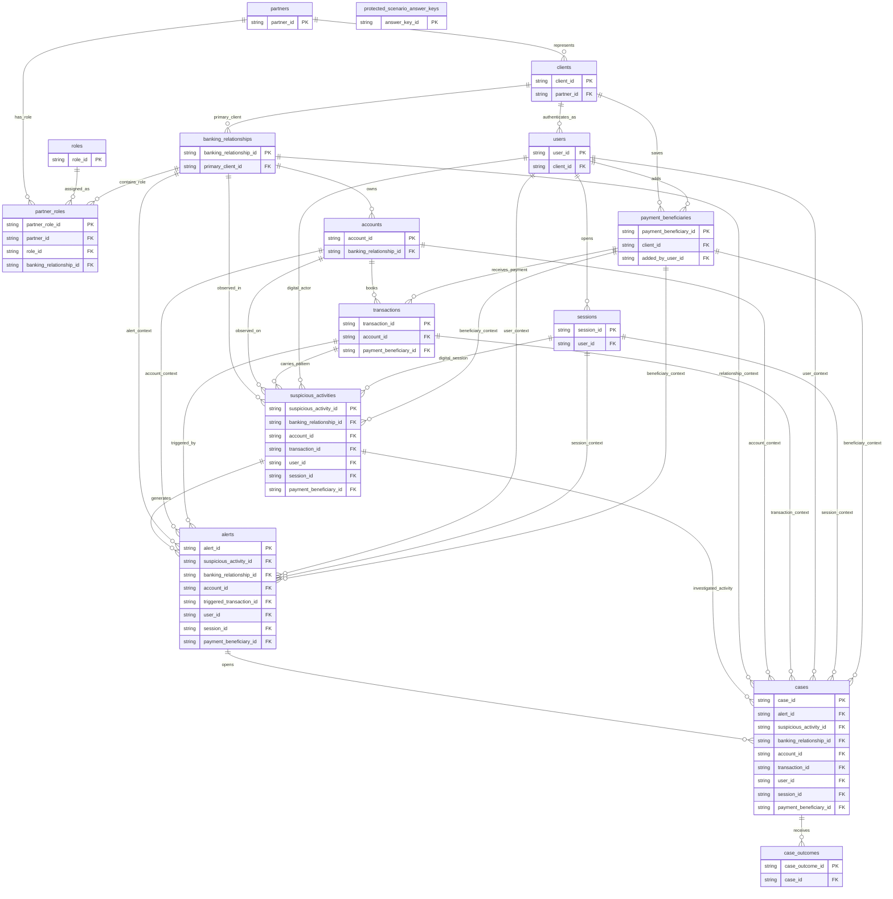

# ERD-Backed Schema Tour

This tour shows the v0.2 foundation schema as one **Realistic synthetic data
model**. It is intentionally foundation-level: it explains how **Partner**,
**Client**, **User**, **Banking relationship**, accounts, sessions, **Detection
pattern** observations, and the **Alert lifecycle** connect before later modules
add deeper private-banking or digital-banking features.

The canonical schema remains the source of truth in
`src/banking_fraud_lab/schema/tables.py`. This page is a learner-facing ERD tour
and is tested against that contract.

## Foundation ERD

## How To Read The Foundation Model

- **Partner** records are natural or legal persons in the core model.
- **Client** records identify the legal customer and point back to a Partner.
- **User** records are digital login identities owned by a Client.
- A **Banking relationship** groups the Client's service arrangement, accounts,
  Partner roles, and downstream Alert lifecycle context.
- Suspicious activities record observed **Detection pattern** signals before an
  alert is generated.
- The **Alert lifecycle** flows from suspicious activity to alert, optional case,
  and optional case outcome.
- `protected_scenario_answer_keys` is intentionally outside learner-facing
  Progressive data views.

## Contract Table Map

| Table | Primary key | Relationship references |
| --- | --- | --- |
| `partners` | `partner_id` | None |
| `clients` | `client_id` | `partners.partner_id` |
| `roles` | `role_id` | None |
| `partner_roles` | `partner_role_id` | `partners.partner_id`, `roles.role_id`, `banking_relationships.banking_relationship_id` |
| `banking_relationships` | `banking_relationship_id` | `clients.client_id` |
| `accounts` | `account_id` | `banking_relationships.banking_relationship_id` |
| `transactions` | `transaction_id` | `accounts.account_id`, `payment_beneficiaries.payment_beneficiary_id` |
| `users` | `user_id` | `clients.client_id` |
| `sessions` | `session_id` | `users.user_id` |
| `payment_beneficiaries` | `payment_beneficiary_id` | `clients.client_id`, `users.user_id` |
| `suspicious_activities` | `suspicious_activity_id` | `banking_relationships.banking_relationship_id`, `accounts.account_id`, `transactions.transaction_id`, `users.user_id`, `sessions.session_id`, `payment_beneficiaries.payment_beneficiary_id` |
| `alerts` | `alert_id` | `suspicious_activities.suspicious_activity_id`, `banking_relationships.banking_relationship_id`, `accounts.account_id`, `transactions.transaction_id`, `users.user_id`, `sessions.session_id`, `payment_beneficiaries.payment_beneficiary_id` |
| `cases` | `case_id` | `alerts.alert_id`, `suspicious_activities.suspicious_activity_id`, `banking_relationships.banking_relationship_id`, `accounts.account_id`, `transactions.transaction_id`, `users.user_id`, `sessions.session_id`, `payment_beneficiaries.payment_beneficiary_id` |
| `case_outcomes` | `case_outcome_id` | `cases.case_id` |
| `protected_scenario_answer_keys` | `answer_key_id` | None |

## Learner Path

Start with `foundation_client_relationships` when the lesson needs a compact
Client, Partner, and Banking relationship anchor. Move to canonical tables when
the lesson needs role history, account detail, transaction detail, or digital
User/session context.

Start with `foundation_alert_lifecycle` when the lesson needs the Alert lifecycle
in one surface. Move to `suspicious_activities`, `alerts`, `cases`, and
`case_outcomes` when the lesson needs to explain each lifecycle transition.
